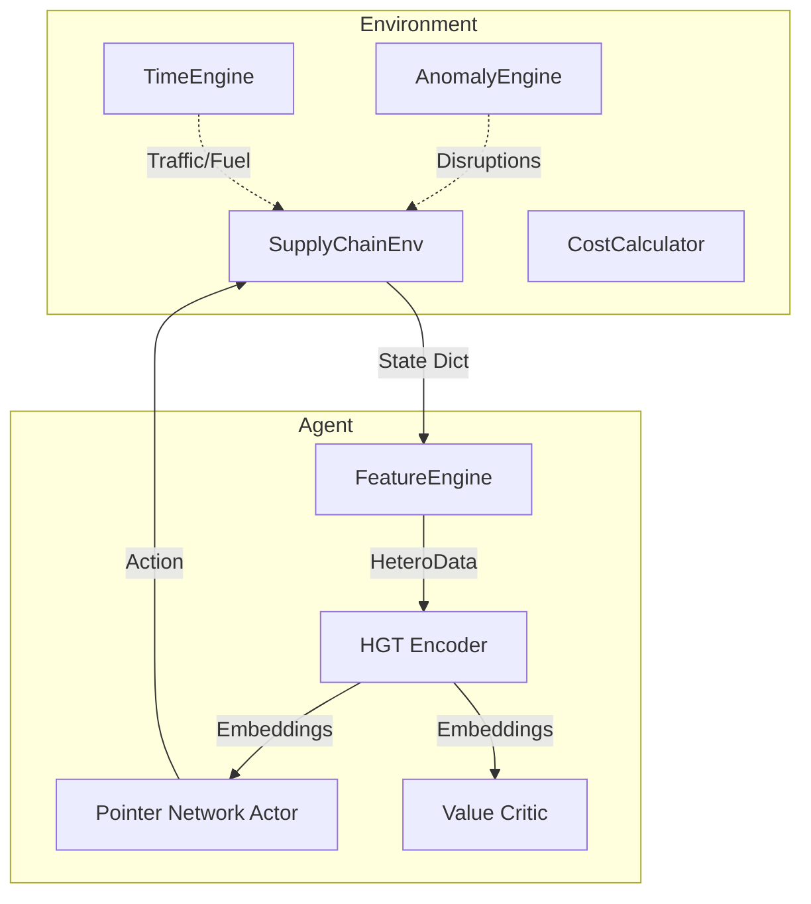

# Supply Chain Optimization with Graph ML & RL

This project is a production-grade supply chain optimization system that uses **Heterogeneous Graph Transformers (HGT)** and **Reinforcement Learning (PPO)** to solve dynamic routing and vehicle selection problems.

## 🚀 System Architecture

The system follows an Actor-Critic architecture where the state is represented as a heterogeneous graph of the supply chain network.

## 📁 Directory Map

- `src/environment/`: Core simulation logic.
    - `supply_chain_env.py`: Gymnasium environment.
    - `anomaly_engine.py`: Stochastic disruptions (weather, traffic, etc.).
    - `time_engine.py`: Temporal cycles (traffic, fuel prices).
    - `cost_calculator.py`: Complex operational cost logic.
- `src/features/`: Data transformation.
    - `feature_engine.py`: Converts env state to `torch_geometric.data.HeteroData`.
- `src/models/`: Neural architectures and training.
    - `hgt_encoder.py`: Heterogeneous Graph Transformer.
    - `ppo_agent.py`: Actor-Critic with Pointer Networks for variable-degree action selection.
    - `train.py`: PPO training with curriculum support.
- `src/agents/`: Specialized AI agents.
    - `explainer.py`: Vertex AI / Gemini 3 Flash based path explanation agent.
- `dashboard/`: Visualization layer.
    - `app.py`: FastAPI backend with WebSocket streaming.
    - `static/`: Frontend assets (Leaflet.js map, React-like UI).
- `tests/`: Verification suite (`pytest` compatible).

## 📊 Core Data Schema

### HeteroData (GNN State)
The `FeatureEngine` builds a heterogeneous graph with the following schema:
- **Nodes**:
    - `location`: [lat, lng, risk, region_type, warehouse_info, is_current, is_dest, dist_to_dest, on_nominal_path] (Dim: 10)
    - `vehicle`: [type, payload, efficiency, age, maintenance, speed, capacity_check] (Dim: 7)
    - `shipment`: [type, fragility, shelf_life, temp_sens, weight, volume, density, insurance, priority, remaining_shelf] (Dim: 10)
- **Edges**:
    - `(location, route, location)`: [distance, terrain, road_grading, toll, mileage_cost, base_time, anomaly_time, anomaly_cost, risk, is_to_dest] (Dim: 10)
    - `(vehicle, vehicle_at, location)`
    - `(shipment, shipment_at, location)`
    - `(shipment, shipment_dest, location)`

### Action Space
`MultiDiscrete([max_neighbors, max_vehicles])`
- `action[0]`: Index into the list of current node's neighbors.
- `action[1]`: Index into the list of available vehicles.

## 🌪️ Simulation Mechanics

### Anomaly Engine
Simulates stochastic disruptions:
- **Edge Anomalies**: Weather, Traffic, Geopolitical (affects time and cost).
- **Node Anomalies**: Port congestion, Warehouse issues (affects delay and risk).
- **Sentiment**: Social media/news sentiment affecting route risk.

### Reward Function
$R = B_{arrival} - P_{time} - P_{cost} - P_{risk} - P_{spoilage} - P_{loop} - P_{step}$
- Includes **Potential-based Reward Shaping** using shortest-path distances.
- **Loop Penalty**: Escalates exponentially (base × 1.5^revisits).

## 🧠 Training & Curriculum

Training uses **PPO** with a 3-phase curriculum:
1.  **Phase 1 (Easy)**: Few anomalies, short paths, limited vehicle types.
2.  **Phase 2 (Medium)**: Moderate anomalies, longer paths, all vehicles.
3.  **Phase 3 (Full)**: High anomaly frequency, full network, all constraints.

## 🤖 Vertex AI Path Explainer

Whenever the RL agent deviates from the nominal optimal path (Dijkstra shortest path based on base times), the system invokes a **Gemini 3 Flash** model to explain the decision.
- **Source**: `src/agents/explainer.py`
- **Trigger**: Detected in `dashboard/app.py` when `chosen_hop != optimal_next_hop`.
- **Output**: Displayed in the "AI Path Insights" panel of the dashboard.

## 🛠️ Key Commands

- **Set up**: `uv sync`
- **Train**: `python main.py train`
- **Dashboard**: `python main.py dashboard` (port 8000)
- **Evaluate**: `python main.py eval` (best trained model)
- **Tests**: `pytest`

## 🌐 Deployment
Optimized for **Google Cloud Run**. Uses `Dockerfile` with `uv`. WebSocket support enabled. Run with `--no-cpu-throttling` for responsive simulation.

